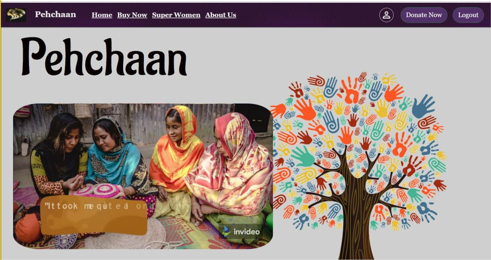
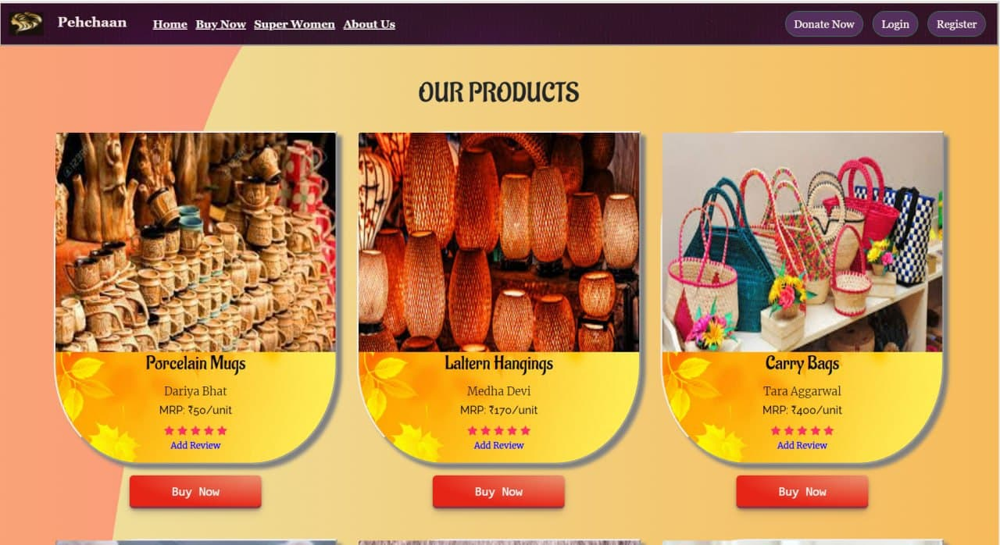
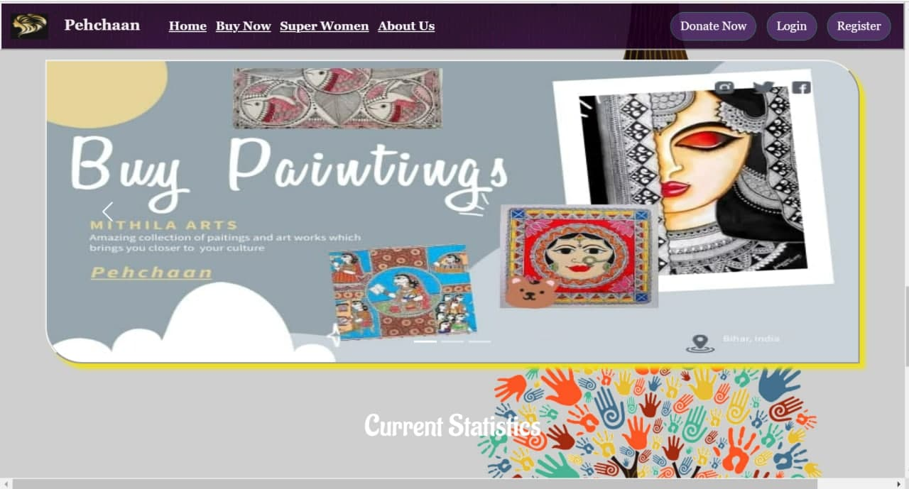
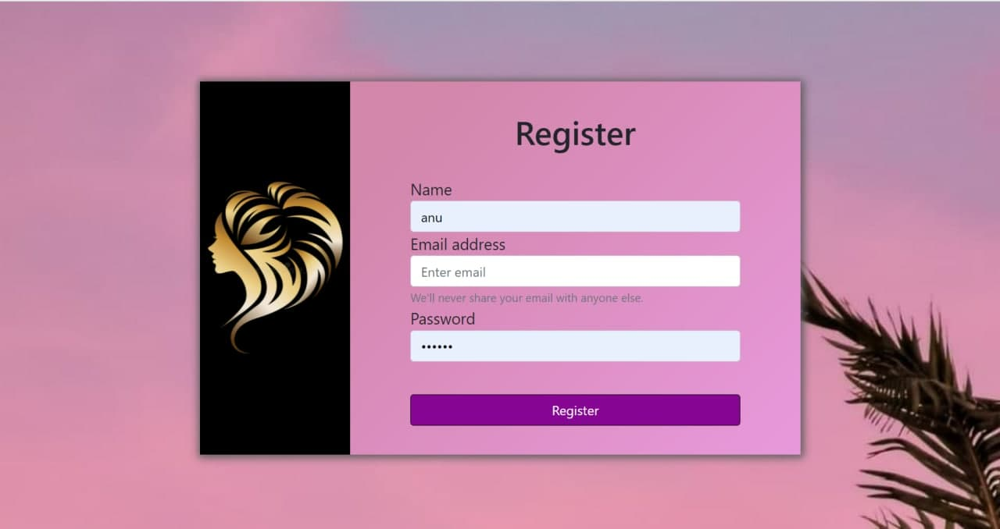
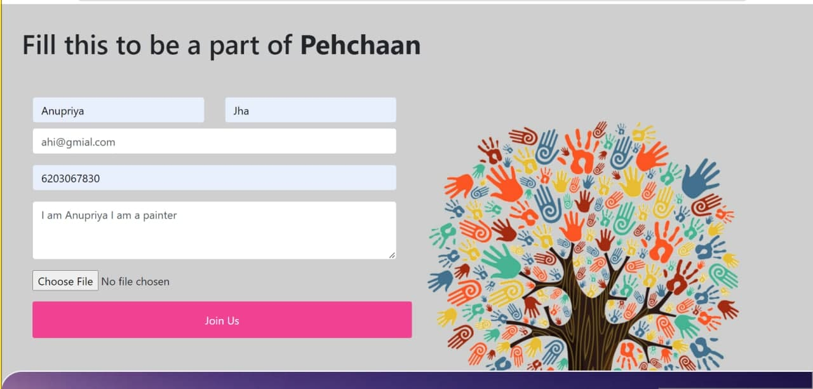
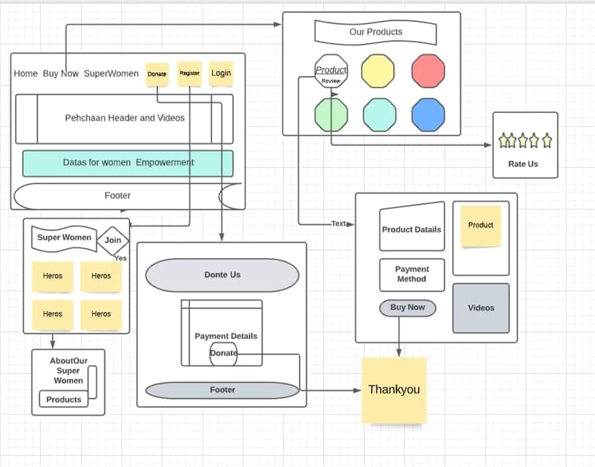

# Pehchaan
A Website for providing identity to all those unprivileged women who have the talent and skills to earn on their own anywhere from India by empowering them and providing a platform for showcasing their products to the world.

**Video link -** https://youtu.be/4VlfbPfWkpQ

**Presentation link -** https://docs.google.com/presentation/d/190YLR9iLPuaf-0NeyheYijb9hmGvTtwD/edit?usp=sharing&ouid=100280527250510962211&rtpof=true&sd=true 

**Home Page -**

**Product Page -**

**Register Page -**

**To be a part of us -**

**Dependencies used in the project -**

   "dependencies": {
   - [x] "body-parser": "^1.19.0",
   - [x] "ejs": "^3.1.6",
   - [x]  "express": "^4.17.1",
   - [x] "express-session": "^1.17.2",
   - [x] "mongoose": "^5.12.12",
   - [x] "passport": "^0.4.1",
   - [x] "passport-local": "^1.0.0",
   - [x] "passport-local-mongoose": "^6.1.0"
  },
  
 "devDependencies": {
   - [x] "nodemon": "^2.0.15"
  }
  
 ***Tech Stacks used -***
 
   - [x] Node.js
   - [x] EJS
   - [x] MongoDB
   - [x] CSS
   - [x] Bootstrap
   - [x] JavaScript
  
  **FLOW CHART**

 **To run the project -**
 
    -step1 - run npm i
    -step2 - run npm start
    
    
